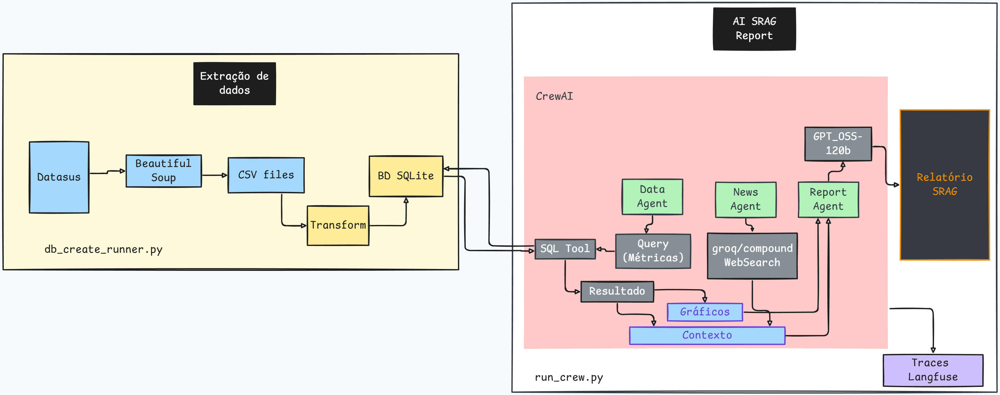

# Agente de Monitoramento SRAG – Automação Inteligente de Relatórios
<p align="left">

  <!-- Python -->
  

  <!-- UV -->
  

  <!-- Ruff -->
  

  <!-- CrewAI -->
  

  <!-- Groq -->
  

  <!-- OpenAI -->
  

  <!-- Langfuse -->
  

</p>

Este projeto implementa uma solução de GenAI aplicada à vigilância epidemiológica, automatizando a geração de relatórios dos casos de Síndrome Respiratória Aguda Grave (SRAG) no Brasil.
O sistema integra extração de dados públicos, processamento, criação de banco de dados, análise automatizada, visualização e geração de relatórios usando agentes inteligentes (CrewAI + LLMs).

## 📌 Fontes de Dados

Os dados utilizados são públicos e disponibilizados pelo OpenDataSUS, contendo registros detalhados de casos de SRAG desde 2019 até 2025, incluindo:

* dados demográficos,

* evolução clínica,

* vacinação,

* internações e uso de leitos,

### 🔗 Dataset oficial:
[OpenDataSUS](https://opendatasus.saude.gov.br/dataset/srag-2021-a-2024)


## Arquitetura do Sistema

O desenvolvimento segue uma arquitetura modular, separando:

* Extração e construção do banco de dados,
* Agentes de consulta e análise (Data Agent),
* Agente de notícias (News Agent) que efetua buscas na Web,
* Agente gerador de relatórios (Report Agent) que une todo o contexto gerado pelas métricas e buscas na internet..
* Traces armazenados no Langfuse




## 📂 Estrutura do Projeto

```bash
ai_engineer_projects/
├── data/                     # Arquivos CSV extraídos da fonte oficial
│
├── docs/
│   └── Dicionario de dados/  # Documentação das colunas do dataset
│
├── reports/
│   └── relatorio_srag_20251114_143614.md  # Exemplo de relatório gerado
│
├── src/
│   ├── agents/
│   │   ├── data_agent.py     # Obtém métricas SQL e monta contexto para LLM
│   │   ├── news_agent.py     # Agente com Web Search
│   │   └── report_agent.py   # Gera relatório consolidado
│   │
│   ├── notebooks/
│   │   └── EDA/
│   │       └── srag2025.ipynb  # Análise exploratória
│   │
│   ├── tools/
│   │   └── sql_tool.py       # Tool customizada para consultas SQL
│   │
│   └── utils/
│       ├── db_utils.py       # Funções para criação do banco de dados
│       ├── eda_utils.py      # Funções auxiliares de análise
│       └── get_data.py       # Extração de dados da fonte
│
├── .env-example               # Template de variáveis de ambiente
├── .pre-commit-config.yaml    # Hooks de lint/format
├── db_create_runner.py        # Pipeline de criação do banco de dados
├── pyproject.toml             # Dependências e configurações
├── run_crew.py                # Pipeline principal da IA que gera o relatório
└── srag.db                    # Banco SQLite criado automaticamente
```


## Getting Started

### Requisitos
- Python 3.11
- UV package manager
- Opcional: Ruff, pre-commit

### Como executar.

Clone o repositório:
```bash
git clone https://github.com/AurelioGuilherme/ai_engineer_projects
cd ai_engineer_projects

```
Instale as dependencias com o UV

```bash
uv sync

```
Ative a virtualenv:

```bash
 # No Windows
.venv/Scripts/activate 

 # No linux/Mac
source .venv/bin/activate 
```

## 🔑 Variáveis de Ambiente

Copie o arquivo de exemplo:
```bash
cp .env-example .env
```

Edite com suas chaves:
```ini
GROQ_API_KEY='your-grog-api-key'
LANGFUSE_SECRET_KEY="your-langfuse-secret-key"
LANGFUSE_PUBLIC_KEY="your-langfuse-public-key"
LANGFUSE_BASE_URL="https://cloud.langfuse.com"
```

## 🗂️ Criação do Banco de Dados
O pipeline baixa os CSVs do OpenDataSUS e cria o banco srag.db automaticamente:

```bash
UV db_create_runner.py
```
Esse passo inclui:

✔ Download dos dados
✔ Limpeza e transformação dos dados
✔ Criação de tabelas
✔ Carga completa no banco SQLite

## 🤖 Gerar o Relatório (CrewAI Pipeline)
Execute o pipeline principal com agentes:

```bash
uv run_crew.py
```

O fluxo executa:

* **Data Agent**: extrai métricas SQL e gera análises estatísticas
* **News Agent**: integra notícias recentes sobre SRAG/saúde
* **Report Agent**: compila tudo em um relatório markdown dentro de /reports


## 🧠 Funcionamento dos Agentes
**Data Agent**

> - Executa consultas SQL
> - Calcula métricas epidemiológicas
> - Identifica variações semanais/mensais


**News Agent**

> - Realiza Web Search
> - Extrai contexto de notícias recentes sobre SRAG no Brasil

**Report Agent**

> - Gera plotagens e salva gráficos
> - Consolida métricas + insights + notícias
> - Gera relatório final em Markdown
> - Pode ser estendido para gerar PDF/HTML

## ✨ Funcionalidades

> * Automação completa da análise epidemiológica
> * Agentes colaborativos com CrewAI
> * Geração de relatório com texto natural (LLM)
> * Geração automática de gráficos
> * Banco SQLite com queries eficientes
> * Modular, extensível e pronto para produção
> * Pipeline reprodutível
> * Acompanhamento de Traces pelo Langfuse


## 🧪 Qualidade de Código

O projeto utiliza:
```bash
pre-commit  # Verifica o código antes de efetuar o push
ruff check  # Indica os erros e melhorias possiveis para legibilidade do código.
```