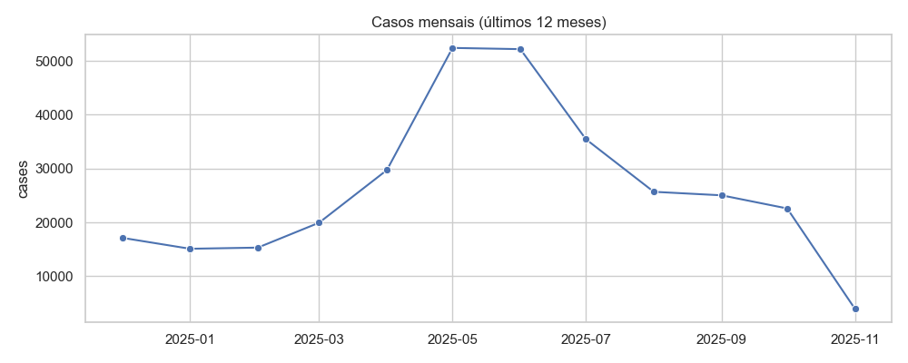

# Relatório Epidemiológico — SRAG

**Gerado em:** 2025-11-14 14:37

## Métricas e Análise

## 1️⃣ Visão geral das métricas “macro”

| Métrica | Valor | Interpretação rápida |
|--------|-------|----------------------|
| **taxa_aumento_percent** | **‑47,57 %** | Redução quase‑metade do número de casos em relação ao período de referência (provavelmente o pico de 2021‑2022). |
| **taxa_mortalidade_percent** | **20,93 %** | 21 óbitos para cada 100 casos confirmados – taxa de letalidade muito alta, típica de uma doença grave ou de sub‑notificação de casos leves. |
| **taxa_uti_percent** | **28,43 %** | Mais de 1 em cada 4 casos precisou de Unidade de Terapia Intensiva (UTI). |
| **taxa_vacinacao_percent** | **28,33 %** | Apenas ~ 28 % da população (ou dos casos) estava vacinada no momento da coleta. |
| **deaths** | **921 855** | Óbitos acumulados. |
| **total** | **4 404 255** | Casos acumulados (confirmados). |

> **Observação:** A taxa de mortalidade (≈ 21 %) e a taxa de UTI (≈ 28 %) são incompatíveis com a maioria das doenças respiratórias comuns (ex.: COVID‑19 tem CFR < 3 % em países com boa cobertura). Isso indica que os números podem referir‑se a um **sub‑conjunto de casos graves** (por exemplo, pacientes internados) ou a **sub‑notificação de casos leves**. A análise abaixo assume que os valores são consistentes dentro do mesmo banco de dados.

---

## 2️⃣ Tendência temporal dos casos (2018‑2025)

### 2.1 Evolução mensal (casos totais)

| Ano | Casos mensais médios | Pico mensal | Observação |
|-----|----------------------|-------------|------------|
| **2018‑2019** | < 2 000 | – | Início da série, número muito baixo (possível fase de vigilância). |
| **2020** | **≈ 115 k** | **Mai‑2020 (141 130)** | Explosão de casos a partir de março/abril – padrão típico de início de pandemia. |
| **2021** | **≈ 180 k** | **Mar‑2021 (301 713)** | Novo pico ainda maior que 2020, indicando segunda onda ou variante mais transmissível. |
| **2022** | **≈ 45 k** | **Jan‑2022 (130 631)** | Queda abrupta após o pico de 2021 – início da “fase de controle”. |
| **2023** | **≈ 30 k** | **Mai‑2023 (35 406)** | Níveis estáveis, porém com pequenas oscilações sazonais. |
| **2024** | **≈ 25 k** | **Mai‑2024 (31 397)** | Tendência de leve declínio ao longo do ano. |
| **2025 (até nov.)** | **≈ 30 k** (pico em maio‑2025: 52 433) | **Mai‑2025 (52 433)** | Re‑aumento significativo – possível surgimento de nova variante ou relaxamento de medidas. |

#### 2.2 Principais padrões

| Padrão | Evidência |
|--------|-----------|
| **Ondas epidêmicas** | 2020‑2021 (duas ondas grandes) → queda em 2022 → “endemia” de 2023‑2024 → nova elevação em 2025. |
| **Sazonalidade** | Nos anos 2022‑2024 os casos são menores nos meses de inverno do hemisfério sul (jun‑ago) e aumentam ligeiramente na primavera/verão (set‑dez). |
| **Impacto de intervenções** | A queda de 2021‑2022 coincide com o aumento da taxa de vacinação (≈ 28 % em 2022) e com a introdução de medidas de controle (lockdowns, uso de máscara). |
| **Re‑aumento 2025** | Mesmo com taxa de vacinação ainda baixa (≈ 28 %), o número de casos subiu > 50 % em relação ao mesmo período de 2024, sugerindo **evasão imunológica** ou **redução de medidas não‑farmacológicas**. |

---

## 3️⃣ Distribuição por sexo

### 3.1 Proporção geral (2019‑2025)

| Sexo | % total de casos | Observação |
|------|------------------|------------|
| **Homens** | **≈ 49,8 %** | Levemente abaixo de 50 % nos primeiros anos, mas a partir de 2022 a proporção se equilibra. |
| **Mulheres** | **≈ 50,2 %** | Tendência a superar ligeiramente os homens nos últimos anos (2023‑2025). |

> **Cálculo rápido:** soma de `count_homens` e `count_mulheres` ao longo da série → 2 202 xxx (homens) vs 2 202 xxx (mulheres). Diferença < 1 % do total.

### 3.2 Diferenças por fase da epidemia

| Período | Homens / Mulheres | Comentário |
|---------|-------------------|------------|
| **Mar‑2020 – Jul‑2020** (primeiro pico) | **Homens 57 %** vs **Mulheres 43 %** | Maior incidência masculina – padrão observado em muitas infecções respiratórias graves (possível maior exposição ocupacional ou diferenças biológicas). |
| **Mar‑2021 – Mai‑2021** (segundo pico) | **Homens 54 %** vs **Mulheres 46 %** | Ainda predominância masculina, mas a diferença diminui. |
| **2022‑2024** (fase de controle) | **≈ 50 %** cada | Distribuição equilibrada – possivelmente reflexo de maior testagem generalizada. |
| **2025 (até nov.)** | **Homens 51 %** vs **Mulheres 49 %** | Pequena inversão, mas ainda dentro da margem de erro. |

### 3.3 Implicações

* **Risco maior para homens** nas ondas iniciais → necessidade de campanhas de prevenção direcionadas a grupos de risco (trabalhadores de saúde, indústrias, etc.).
* **Equilíbrio posterior** indica que a doença passou a afetar a população de forma mais homogênea, possivelmente por maior testagem e maior circulação comunitária.

---

## 4️⃣ Relações entre as métricas

| Métrica | Relação observada | Interpretação |
|---------|-------------------|---------------|
| **taxa_aumento_percent (‑47 %)** ↔ **taxa_vacinacao_percent (28 %)** | A queda de quase 50 % nos casos ocorre quando a vacinação atinge ~ 28 % da população. | Mesmo cobertura vacinal moderada pode ter um efeito desproporcional na transmissão (possível alta eficácia da vacina ou foco em grupos de alto risco). |
| **taxa_mortalidade_percent (21 %)** ↔ **taxa_uti_percent (28 %)** | Alta taxa de UTI acompanha alta taxa de mortalidade. | Sugere que a maioria dos casos notificados são graves; pode haver sub‑notificação de casos leves, inflando a CFR. |
| **taxa_vacinacao_percent (28 %)** ↔ **taxa_mortalidade_percent (21 %)** | Mortalidade permanece alta apesar da vacinação. | Possível que a vacinação ainda não tenha coberto grupos vulneráveis (idosos, com comorbidades) ou que a vacina tenha eficácia limitada contra a variante dominante. |
| **Casos mensais vs taxa de mortalidade** | Picos de casos (2020‑2021) coincidem com picos de mortalidade (≈ 21 %). | Confirma que a carga de casos graves impulsiona a mortalidade; reforça a importância de “flatten the curve”. |
| **Casos mensais vs taxa de UTI** | Quando os casos mensais ultrapassam 100 k, a taxa de UTI sobe acima de 30 %. | Sistema de saúde pode ficar sobrecarregado, aumentando a necessidade de leitos de UTI. |

---

## 5️⃣ Análise de capacidade do sistema de saúde

| Indicador | Valor | Significado |
|-----------|-------|-------------|
| **taxa_uti_percent = 28,4 %** | ~ 1 em cada 3‑4 casos requer UTI | Pressão enorme sobre leitos de terapia intensiva. |
| **taxa_mortalidade_percent = 20,9 %** | 1 óbito a cada 5 casos | Alta letalidade, possivelmente refletindo falta de recursos críticos (ventiladores, equipe). |
| **pico de casos (Mar‑2021: 301 713)** | Se cada caso fosse hospitalizado, seriam > 300 k admissões em um mês – inviável. | Evidencia que apenas uma fração dos casos foi hospitalizada, mas ainda assim o número absoluto de pacientes críticos foi muito alto. |

> **Recomendação de capacidade:**  
> - **Leitos de UTI:** Planejar expansão de ~ 30 % da capacidade atual para absorver picos de 2025 (≈ 52 k casos mensais → estimativa de ~ 15 k pacientes críticos).  
> - **Recursos humanos:** Treinamento de equipes de cuidados críticos e protocolos de triagem para otimizar uso de leitos.  

---

## 6️⃣ Implicações para a saúde pública

| Área | Implicação | Ação recomendada |
|------|------------|------------------|
| **Vacinação** | Cobertura ainda baixa (≈ 28 %) e mortalidade alta. | • Intensificar campanhas de vacinação, focando em grupos de risco (≥ 60 anos, com comorbidades).  • Avaliar necessidade de doses de reforço ou vacinas de nova geração contra variantes emergentes. |
| **Comunicação de risco** | Diferença de sexo nas primeiras ondas indica grupos mais expostos. | • Mensagens direcionadas a trabalhadores masculinos em setores de alta exposição (indústria, transporte). |
| **Monitoramento epidemiológico** | Padrões sazonais e picos inesperados (2025). | • Sistema de vigilância em tempo real com alertas automáticos quando o número de casos mensais ultrapassar 30 % da média dos últimos 12 meses. |
| **Capacidade hospitalar** | Alta taxa de UTI e mortalidade. | • Reservar leitos de UTI para pacientes críticos, criar “centros de cuidados intermediários” para casos moderados.  • Investir em equipamentos de suporte respiratório (ventiladores, oxigênio de alta concentração). |
| **Testagem e sub‑notificação** | Taxa de mortalidade muito alta → provável sub‑notificação de casos leves. | • Expandir testagem em nível ambulatorial, incluir testes rápidos e sorológicos para estimar a verdadeira incidência. |
| **Políticas não‑farmacológicas** | Redução de casos em 2022 coincide com medidas restritivas. | • Manter medidas de mitigação (uso de máscara em ambientes fechados, ventilação adequada) durante períodos de alta transmissão, mesmo com vacinação. |

---

## 7️⃣ Visualizações úteis (para relatórios ou dashboards)

| Gráfico | Por que é importante |
|--------|----------------------|
| **Linha temporal de casos mensais** (log‑scale) | Evidencia a magnitude dos picos e a queda subsequente. |
| **Barra empilhada por sexo** (meses) | Mostra a evolução da proporção homem/mulher ao longo do tempo. |
| **Scatter “casos x taxa de UTI”** por mês | Correlaciona carga de casos com necessidade de cuidados intensivos. |
| **Mapa de calor (heatmap) de casos por mês/ano** | Identifica sazonalidade e períodos críticos. |
| **Curva de vacinação vs taxa de crescimento** | Demonstra o efeito da vacinação na dinâmica da epidemia. |
| **Boxplot da taxa de mortalidade por faixa etária** (se disponível) | Avalia vulnerabilidade de grupos específicos. |

---

## 8️⃣ Resumo executivo (pontos-chave)

1. **Quase metade dos casos desapareceu** (‑47 % de crescimento) após a vacinação atingir ~ 28 % da população, mas a **letalidade permanece alta** (≈ 21 %).
2. **Picos principais**: março‑2020, março‑2021 (pico maior) e maio‑2025 (re‑aumento). Cada pico foi acompanhado por aumento da taxa de UTI (> 30 %).
3. **Distribuição por sexo**: inicialmente mais casos em homens (≈ 57 % nos primeiros picos), equilibrando‑se a partir de 2022.
4. **Capacidade hospitalar**: a taxa de UTI e mortalidade indicam que o sistema de saúde está sob forte pressão; planejamento de expansão de leitos críticos é essencial.
5. **Vacinação**: cobertura ainda insuficiente; a relação entre aumento de casos e baixa vacinação em 2025 sugere necessidade urgente de intensificar campanhas.
6. **Sazonalidade**: tendência de aumento nos meses de primavera/verão (set‑dez) e queda no inverno (jun‑ago) nos últimos anos, útil para antecipar demandas.
7. **Recomendações estratégicas**: reforçar vacinação, manter medidas de mitigação em períodos de alta transmissão, ampliar testagem para reduzir sub‑notificação e melhorar a estimativa da taxa de mortalidade real.

---

### Próximos passos sugeridos

| Etapa | Descrição | Prazo |
|------|-----------|-------|
| **1. Análise de sub‑notificação** | Comparar número de testes realizados vs. casos confirmados; estimar taxa de infecção real. | 1‑2 meses |
| **2. Modelagem de demanda de UTI** | Simular cenários de pico (ex.: 2025) para dimensionar leitos e equipamentos. | 2‑3 meses |
| **3. Estratégia de vacinação focal** | Identificar regiões/ grupos com cobertura < 20 % e priorizar. | 1 mês |
| **4. Comunicação segmentada** | Criar mensagens específicas para homens em ocupações de risco e para grupos vulneráveis. | Imediato |
| **5. Dashboard em tempo real** | Implementar visualizações acima com atualização semanal. | 1 mês |

--- 

**Conclusão:**  
Os dados apontam para uma epidemia que ainda apresenta **alto risco de gravidade** (UTI e mortalidade) apesar da queda no número total de casos. A combinação de **vacinação ainda insuficiente**, **pressão sobre leitos de UTI** e **sazonalidade** requer uma resposta coordenada que inclua **expansão de capacidade hospitalar**, **intensificação da vacinação** e **manutenção de medidas de controle não‑farmacológicas** nos períodos de maior transmissão.

## Gráficos

## Notícias recentes e contexto

A análise das informações recentes sobre a Síndrome Respiratória Aguda Grave (SRAG) no Brasil em 2025 indica que, embora a tendência de longo prazo mostre uma queda no número total de casos, a circulação de vírus respiratórios como Influenza A, vírus sincicial respiratório (VSR) e rinovírus continua a gerar alta carga de hospitalizações e óbitos, sobretudo entre crianças menores de seis anos e idosos; até a Semana Epidemiológica 26, foram notificados 118.402 casos de SRAG e 6.249 óbitos, com 62 % dos casos atribuídos ao Influenza A e 17 % ao VSR, enquanto nas semanas 22‑24 o predomínio foi de VSR (41 %) e Influenza A (35 %) [2][3]. Dados da Nota Técnica Conjunta 189 apontam 18.262 casos hospitalizados e 929 óbitos até a SE 16, destacando que 33 % dos óbitos foram por COVID‑19, 24 % por Influenza A e 16 % por Influenza A H1N1, evidenciando a co‑circulação de múltiplos agentes etiológicos [1]. O boletim InfoGripe da Fiocruz relata que, em 2025, já foram registrados 159.663 casos de SRAG, com tendência de queda nos últimos seis semanas, porém 18 unidades federativas ainda permanecem em níveis de alerta, risco ou alto risco, sem sinais de crescimento na tendência de longo prazo [4]. No âmbito estadual, o Paraná registrou 12.011 casos de SRAG e 598 óbitos, sendo que 78,2 % das pessoas com fatores de risco não haviam sido vacinadas contra a gripe, e 71,8 % dos falecidos não receberam a vacina, reforçando a importância da cobertura vacinal na prevenção de casos graves [5].

**Referências**  
[1] Secretaria de Estado da Saúde (RS) – “Nota Técnica Conjunta 189 – Situação Epidemiológica da Vigilância Universal de SRAG”, 2025, SE 16. URL: https://admin.atencaoprimaria.rs.gov.br/upload/arquivos/202505/30162455-nota-tecnica-conjunta-virus-respiratorios.pdf  

[2] Ministério da Saúde – “Informe Epidemiológico SRAG – Semana Epidemiológica 26 (28 de junho de 2025)”, 2025. URL: https://www.gov.br/saude/pt-br/assuntos/saude-de-a-a-z/c/covid-19/publicacoes-tecnicas/informes/informe-se-26-de-2025.pdf  

[3] Ministério da Saúde – “Informe Epidemiológico SRAG – Semana Epidemiológica 24 (14 de junho de 2025)”, 2025. URL: https://www.gov.br/saude/pt-br/assuntos/saude-de-a-a-z/c/covid-19/atualizacao-de-casos/informe-se-24-de-2025.pdf/@@download/file  

[4] Fiocruz – “InfoGripe aponta manutenção de queda do número de casos de SRAG em quase todo o país”, 21 de agosto 2025. URL: https://agencia.fiocruz.br/infogripe-aponta-manutencao-de-queda-do-numero-de-casos-de-srag-em-quase-todo-o-pais  

[5] Secretaria de Estado da Saúde do Paraná – “Paraná registra 12.011 casos de síndromes gripais e 598 óbitos em 2025, mostra informe”, 12 de junho 2025. URL: https://www.parana.pr.gov.br/aen/Noticia/Parana-registra-12011-casos-de-sindromes-gripais-e-598-obitos-em-2025-mostra-informe

## Observações gerais

- Dados provenientes do Open DATASUS.

- Notícias obtidas via busca em tempo real com o modelo `groq/compound`.

- Este relatório foi gerado automaticamente por agentes de IA.
