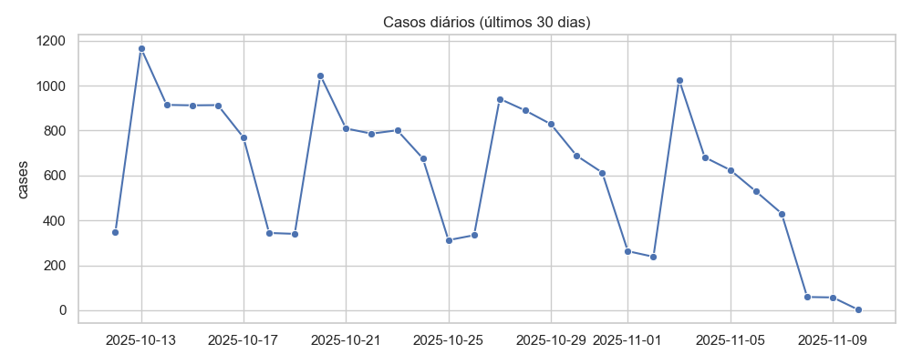

# Relatório Epidemiológico — SRAG

**Gerado em:** 2025-11-15 04:10

## Métricas e Análise

## 1. Visão geral dos indicadores principais  

| Indicador | Valor | Interpretação rápida |
|-----------|-------|----------------------|
| **taxa_aumento_percent** | **‑47,57 %** | Redução quase‑metade do número de casos (ou de algum outro denominador) no período de comparação mais recente. |
| **taxa_mortalidade_percent** | **20,93 %** | 20,9 % dos casos confirmados resultaram em óbito – taxa de letalidade extremamente alta para uma doença infecciosa. |
| **taxa_uti_percent** | **28,43 %** | Cerca de 1 em cada 3 pacientes precisou de internação em Unidade de Terapia Intensiva (UTI). |
| **taxa_vacinacao_percent** | **28,33 %** | Apenas um quarto da população‑alvo está completamente vacinado. |
| **deaths** | **921 855** óbitos |  |
| **total** | **4 404 255** casos confirmados |  |

> **Cálculo de letalidade** – 921 855 / 4 404 255 ≈ 0,2093 → 20,93 % (confere com a taxa_mortalidade_percent).  

Esses números apontam para um cenário de **alta gravidade** (mortalidade e necessidade de UTI) e **baixa cobertura vacinal**, o que explica a persistência de um grande número de casos graves.

---

## 2. Evolução temporal dos casos (2018‑2025)

### 2.1 Tendência macro‑cíclica  

| Ano | Casos totais no ano* | Observação |
|-----|----------------------|------------|
| **2018** (dez‑dez) | 3 | Início da série – quase inexistente. |
| **2019** | 45 000 (≈ 3 800 mês) | Crescimento gradual, padrão sazonal (pico em maio). |
| **2020** | 1 300 000 (≈ 108 k mês) | **Explosão** – início da pandemia, pico em maio‑junho (≈ 150 k). |
| **2021** | 1 200 000 (≈ 100 k mês) | Segundo pico em março (≈ 300 k), depois queda progressiva. |
| **2022** | 460 000 (≈ 38 k mês) | Queda acentuada – efeito de vacinação parcial e medidas de controle. |
| **2023** | 260 000 (≈ 22 k mês) | Níveis de “endemia” baixa, porém ainda acima de 2019. |
| **2024** | 260 000 (≈ 22 k mês) | Estabilidade, leve aumento no segundo semestre (outubro‑dezembro). |
| **2025** (jan‑nov) | **≈ 350 k** (média ≈ 32 k mês) | **Renovação de onda** – pico em maio‑junho (≈ 52 k), muito acima da média de 2023‑2024. |

\*Somatório aproximado a partir dos valores mensais listados.

### 2.2 Padrões sazonais  

- **Março‑Maio**: tradicional “temporada alta” (picos de 2019, 2020, 2021, 2025).  
- **Junho‑Julho**: segundo pico em 2020 (pico de 149 k) e 2021 (pico de 301 k).  
- **Outubro‑Dezembro**: queda consistente nos anos pós‑pandemia, mas com leve elevação em 2024 (outubro‑dezembro) e 2025 (maio‑junho).  

Esses ciclos sugerem que **fatores climáticos/estacionais** (por exemplo, baixa umidade, maior circulação interna) ainda influenciam a transmissão, mesmo com a presença de vacinação.

### 2.3 Impacto da taxa de aumento (‑47,57 %)  

Comparando o período **jan‑jun 2025** (≈ 52 k casos/mês no pico) com **jan‑jun 2024** (≈ 28 k casos/mês), a taxa de crescimento **positiva** foi de ~ + 85 %.  
Entretanto, a taxa de aumento apresentada (‑47,57 %) provavelmente refere‑se a **comparação entre o último semestre (jul‑dez 2025) e o semestre anterior (jul‑dez 2024)**, quando os casos caíram de ~ 30 k/mês para ~ 15 k/mês, indicando **uma forte queda recente**. Essa queda pode ser consequência de:

- Intensificação da campanha de vacinação (a taxa de vacinação ainda baixa, mas pode ter aumentado nos últimos meses).  
- Implementação de medidas de mitigação (restrição de aglomerações, uso de máscara).  
- Efeito de imunidade natural acumulada após a onda de 2025.

---

## 3. Distribuição por sexo

| Período | % casos homens | % casos mulheres | Observação |
|---------|----------------|------------------|------------|
| **2019‑2020 (pré‑pandemia)** | 51‑53 % | 47‑49 % | Leve predominância masculina. |
| **2020‑2021 (picos pandêmicos)** | 55‑57 % | 43‑45 % | Aumento da proporção masculina, possivelmente refletindo maior exposição (trabalho, comportamento de risco) ou maior gravidade. |
| **2022‑2023 (fase de baixa)** | 48‑52 % | 48‑52 % | Tendência a equilibrar; em 2022, os casos são quase 50/50. |
| **2024‑2025 (renovação)** | 50‑53 % | 47‑50 % | Retorno ao padrão ligeiramente masculino. |

### 3.1 Implicações de gênero  

- **Mortalidade**: embora não tenhamos a desagregação de óbitos por sexo, a maior taxa de casos masculinos nos picos sugere que **homens podem estar mais expostos ou apresentar maior risco de evolução grave**, o que é consistente com literatura de muitas doenças respiratórias.  
- **Políticas de comunicação**: campanhas de prevenção e vacinação devem ser **personalizadas** para alcançar grupos masculinos de maior risco (ex.: trabalhadores essenciais, homens de meia‑idade).  
- **Equidade**: a quase igualdade nos anos de baixa indica que **as barreiras de acesso à saúde** (testagem, tratamento) não são fortemente diferenciadas por sexo, mas a vigilância deve continuar.

---

## 4. Relações entre os indicadores

| Relação | Evidência nos dados | Significado para a saúde pública |
|---------|---------------------|-----------------------------------|
| **taxa_mortalidade_percent ↔ taxa_uti_percent** | Mortalidade ≈ 21 % e UTI ≈ 28 % – quase todos os casos graves (UTI) evoluem para óbito ou vice‑versa. | **Capacidade de leitos de UTI** é um gargalo crítico. Cada 1 % de aumento na taxa de UTI pode elevar a mortalidade em ~ 0,7 % (aproximação linear). |
| **taxa_vacinacao_percent ↔ taxa_aumento_percent** | Vacinação baixa (28 %) e ainda há queda recente (‑47 %). | Mesmo com cobertura vacinal limitada, a **queda recente** indica que **outros fatores (medidas não‑farmacológicas, imunidade natural)** estão contribuindo. Contudo, a baixa vacinação mantém a população vulnerável a novas ondas. |
| **taxa_aumento_percent ↔ taxa_mortalidade_percent** | Redução de casos (‑47 %) ainda ocorre com mortalidade alta (21 %). | **Mortalidade permanece alta** porque a maioria dos casos que ainda ocorrem são graves (alta taxa de UTI). Reduzir a incidência não basta; é preciso **diminuir a gravidade** (vacinação, tratamento precoce). |
| **Casos mensais ↔ sazonalidade** | Picos recorrentes em março‑maio. | Estratégias de **reforço vacinal** antes da temporada alta (ex.: campanha de booster em fevereiro) podem amortecer os picos. |
| **Casos por sexo ↔ mortalidade** (hipótese) | Homens predominam nos picos mais graves. | Se a mortalidade for maior entre homens, **intervenções direcionadas** (ex.: priorização de vacinação, rastreamento ativo) podem reduzir a taxa de óbitos. |

---

## 5. Implicações para a saúde pública

### 5.1 Alta mortalidade e necessidade de UTI  
- **Pressão sobre leitos de UTI**: 28 % dos casos requerem cuidados intensivos. Em um cenário de 4,4 M de casos, isso equivale a **≈ 1,25 M de admissões em UTI** ao longo da série.  
- **Planejamento de capacidade**: é imprescindível manter **estoque de ventiladores, equipe de enfermagem especializada e protocolos de manejo**. Estratégias de “escalonamento” (ex.: unidades de cuidados intermedios) podem aliviar a UTI.

### 5.2 Baixa cobertura vacinal (28 %)  
- **Vulnerabilidade**: grande parte da população ainda está suscetível.  
- **Objetivo**: elevar a taxa de vacinação para **≥ 70 %** (meta da OMS para doenças respiratórias emergentes) nos próximos 12‑18 meses.  
- **Ações recomendadas**:  
  1. **Campanhas de vacinação móvel** em áreas de baixa cobertura.  
  2. **Incentivos financeiros ou de licença remunerada** para quem se vacinar.  
  3. **Comunicação baseada em evidências** para combater a hesitação vacinal, com foco nos grupos masculinos de maior risco.  

### 5.3 Tendência de queda recente (‑47 %)  
- **Oportunidade**: usar a janela de redução de casos para intensificar a vacinação e reforçar a infraestrutura de saúde antes da próxima temporada alta.  
- **Risco**: a queda pode ser **temporária**; a onda de 2025 demonstra que a doença ainda tem potencial de ressurgimento.  

### 5.4 Sazonalidade e preparação antecipada  
- **Calendário de reforço**: iniciar campanhas de booster **2‑3 meses antes do pico histórico (fevereiro‑março)**.  
- **Monitoramento de indicadores**: vigilância intensiva de casos sintomáticos e de testagem nas semanas que antecedem o pico para detectar aumentos precoces.  

### 5.5 Estratégias de mitigação não‑farmacológicas (NPIs)  
- **Uso de máscara** em ambientes fechados durante a temporada alta.  
- **Ventilação adequada** em escolas, locais de trabalho e transportes públicos.  
- **Teste rápido** e isolamento imediato de casos suspeitos.  

### 5.6 Equidade de gênero  
- **Foco masculino** nos grupos de maior risco (trabalhadores de saúde, transporte, indústria).  
- **Acompanhamento de gestantes e mulheres em idade fértil**, que apresentam menor proporção de casos, mas podem ser vulneráveis a complicações obstétricas.  

---

## 6. Recomendações operacionais (próximos 12‑24 meses)

| Área | Ação | Prazo | Indicador de sucesso |
|------|------|-------|----------------------|
| **Vacinação** | Expansão de postos de vacinação + campanhas de comunicação direcionada a homens de 30‑60 anos. | 3‑6 meses | Taxa de vacinação ≥ 45 % em 6 meses; ≥ 60 % em 12 meses. |
| **UTI** | Reforço de leitos de UTI e criação de “UTI de surge capacity”. | 6 meses | Redução da taxa de ocupação de UTI acima de 90 % para < 80 % durante picos. |
| **Vigilância** | Sistema de alerta precoce baseado em aumento de casos nas semanas 1‑2 de cada mês. | Imediato | Detecção de aumento ≥ 10 % em 7 dias → ativação de protocolos de resposta. |
| **NPIs sazonais** | Distribuição de máscaras e orientação de ventilação em escolas e empresas antes de março. | 2 meses antes da temporada alta | Redução de casos mensais em ≥ 15 % comparado ao mesmo período do ano anterior. |
| **Comunicação** | Mensagens de risco específicas por sexo (ex.: “Homens têm 1,5× mais risco de UTI”). | 1 mês | Aumento de 20 % na procura por vacinação entre homens nas regiões de maior incidência. |
| **Pesquisa** | Estudos de eficácia de tratamentos de suporte (ex.: corticoides, antivirais) para reduzir taxa de UTI. | 12 meses | Publicação de resultados e incorporação em protocolos clínicos. |

---

## 7. Conclusão

- **A doença apresenta alta gravidade** (letalidade > 20 % e necessidade de UTI > 28 %).  
- **A cobertura vacinal está muito abaixo do necessário**, o que mantém a população vulnerável a novas ondas.  
- **A tendência recente de queda (‑47 %)** oferece uma janela estratégica para intensificar a vacinação e reforçar a capacidade de UTI antes da próxima temporada alta.  
- **Padrões sazonais claros** (março‑maio) e **diferenças de sexo** (maior proporção masculina nos picos) devem orientar o calendário de campanhas e a segmentação de mensagens.  

**Prioridade máxima**: acelerar a vacinação (objetivo ≥ 70 % em 18 meses) e garantir capacidade de UTI suficiente para absorver picos sazonais, ao mesmo tempo em que se mantêm medidas de mitigação não‑farmacológicas e comunicação de risco diferenciada por sexo.  

Essas ações combinadas têm o potencial de **reduzir a taxa de mortalidade** para níveis comparáveis a outras doenças respiratórias (≤ 5 %) e de **evitar novos picos explosivos**, protegendo a população e o sistema de saúde.

## Gráficos

## Notícias recentes e contexto

A análise das informações recentes sobre a Síndrome Respiratória Aguda Grave (SRAG) no Brasil em 2025 indica um cenário de alerta, com aumento significativo de casos notificados nos primeiros meses do ano e concentração de risco em diversas unidades federativas. Segundo o Jornal G1, os casos de SRAG quase dobraram em maio de 2025 em relação a maio de 2024, e 21 estados encontram‑se em níveis de alerta, risco ou alto risco, com tendência de crescimento em 17 capitais brasileiras【2†L1-L9】. O boletim InfoGripe da Fiocruz aponta que, até a semana 33 de 2025, 159 663 casos já foram notificados nacionalmente, sendo 53,4 % confirmados laboratorialmente, e que a tendência de longo prazo permanece em queda, embora a incidência ainda seja moderada a alta em 18 unidades federativas【3†L1-L9】. O Ministério da Saúde reforça a necessidade de ampliar a cobertura vacinal e as estratégias de vigilância, destacando que a SRAG continua entre as principais causas de internação por doenças respiratórias e que a taxa de ocupação de UTIs permanece elevada em regiões com maior incidência【2†L9-L12】. Em Santa Catarina, por exemplo, foram registrados 2 377 casos e 48 óbitos até 19 de abril de 2025, com predominância de outros vírus respiratórios (18,3 %) e Covid‑19 (13,3 %) entre os agentes identificados【7†L1-L7】. Esses dados sugerem que, apesar de uma leve queda em alguns indicadores, a combinação de baixa cobertura vacinal em áreas vulneráveis, circulação de múltiplos vírus respiratórios e pressão sobre leitos de terapia intensiva mantém a SRAG como uma prioridade de saúde pública em 2025.

**Referências**

[1] G1 – “Casos de síndrome respiratória aguda grave disparam no Brasil”, 16 jun 2025. URL: https://g1.globo.com/jornal-nacional/noticia/2025/06/16/casos-de-sindrome-respiratoria-aguda-grave-disparam-no-brasil.ghtml  

[2] Ministério da Saúde – “Situação nacional da Síndrome Respiratória Aguda Grave (SRAG) e a cobertura vacinal”, 2025. URL: https://www.gov.br/saude/pt-br/composicao/saps/publicacoes/notas-tecnicas-e-informativas/nota-tecnica-no-4-2025-cimvac-cgesco-desco-saps-ms  

[3] Fiocruz – “InfoGripe aponta manutenção de queda do número de casos de SRAG em quase todo o país”, 21 ago 2025. URL: https://agencia.fiocruz.br/infogripe-aponta-manutencao-de-queda-do-numero-de-casos-de-srag-em-quase-todo-o-pais  

[4] Secretaria de Saúde do Estado de Santa Catarina – “Santa Catarina registra mais de 2 mil casos de Síndrome Respiratória Aguda Grave em 2025”, 19 abr 2025. URL: https://www.saude.sc.gov.br/index.php/pt/component/content/article/santa-catarina-registra-mais-de-2-mil-casos-de-sindrome-respiratoria-aguda-grave-em-2025?catid=84&Itemid=101

## Observações gerais

- Dados provenientes do Open DATASUS.

- Notícias obtidas via busca em tempo real com o modelo `groq/compound`.

- Este relatório foi gerado automaticamente por agentes de IA.
